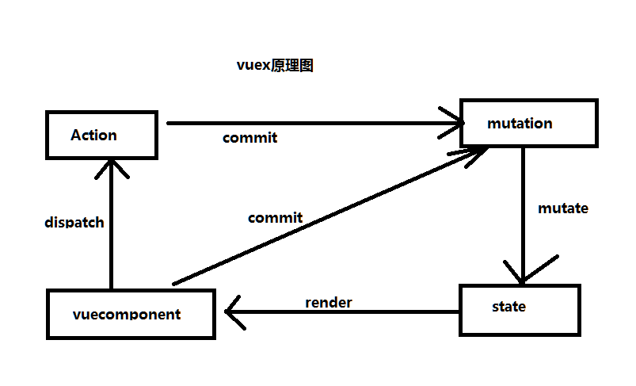

## redux vs vuex

vuex流程：

### [redux](http://www.redux.org.cn/docs/basics/)
#### 基础
- Action

Action是store数据的唯一来源。一般会通过store.dispatch()将action传到store

- Reducer

reducers指定了应用状态的变化如何响应actions并发送到store的，actions只是描述了有事情发生了。

- Store

store就是把它们联系到一起的对象。store有以下职责：
- 维持应用的state
- 提供getState()方法获取state
- 提供 dispatch(action)方法更新state
- 通过subscrible(listener)注册监听器
- 通过subscrible(listener)返回的函数注销监听器

