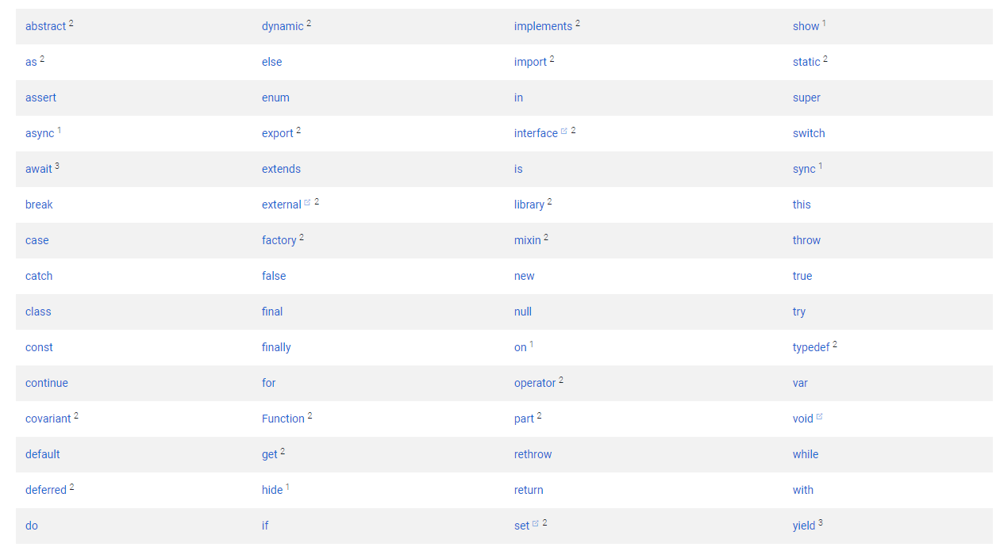

### [dart语言样本概览](https://dart.dev/guides/language/language-tour)
#### 1、每个应用都有一个main()功能.
````
void main(){
  print('Hello world');
}
````
#### 2、在类型的安全的dart代码中，由于type reference功能，大多数变量都不需要显示类型；
````
var name = 'Jack';
var year = 1977;

````
#### 3、控制流方式
dart语言支持通常的控制流方式
````
if (year >= 2001) {
  print('21st century');
} else if (year >= 1901) {
  print('20th century');
}

for (var object in flybyObjects) {
  print(object);
}

for (int month = 1; month <= 12; month++) {
  print(month);
}

while (year < 2016) {
  year += 1;
}

````
#### 函数
建议制定每个函数的参数和返回值的类型
````
int fibonacci(int n) {
  if (n == 0 || n == 1) return n;
  return fibonacci(n - 1) + fibonacci(n - 2);
}

var result = fibonacci(20);

````
#### 注释
````
// This is a normal, one-line comment.

/// This is a documentation comment, used to document libraries,
/// classes, and their members. Tools like IDEs and dartdoc treat
/// doc comments specially.

/* Comments like these are also supported. */

````

#### 引入
获取定义在其他库的api使用 import
````
// Importing core libraries
import 'dart:math';

// Importing libraries from external packages
import 'package:test/test.dart';

// Importing files
import 'path/to/my_other_file.dart';

````
#### 类

如类Spacecraft的定义
````
class Spacecraft {
  String name;
  DateTime launchDate;

  // Constructor, with syntactic sugar for assignment to members.
  Spacecraft(this.name, this.launchDate) {
    // Initialization code goes here.
  }

  // Named constructor that forwards to the default one.
  Spacecraft.unlaunched(String name) : this(name, null);

  int get launchYear =>
      launchDate?.year; // read-only non-final property

  // Method.
  void describe() {
    print('Spacecraft: $name');
    if (launchDate != null) {
      int years =
          DateTime.now().difference(launchDate).inDays ~/
              365;
      print('Launched: $launchYear ($years years ago)');
    } else {
      print('Unlaunched');
    }
  }
}

````

使用spacecraft
````
var voyager = Spacecraft('Voyager I', DateTime(1977, 9, 5));
voyager.describe();

var voyager3 = Spacecraft.unlaunched('Voyager III');
voyager3.describe();

````

#### 继承(Inheritance)
#### Mixins
#### Interfaces and abstract classes
#### async 和 await 同步和异步
#### 异常Exceptions
#### 关键字

说明：
Avoid using these words as identifiers. However, if necessary, the keywords marked with superscripts can be identifiers:

- 上下文变量  Words with the superscript 1 are contextual keywords, which have meaning only in specific places. They’re valid identifiers everywhere.

- 内置变量  Words with the superscript 2 are built-in identifiers. To simplify the task of porting JavaScript code to Dart, these keywords are valid identifiers in most places, but they can’t be used as class or type names, or as import prefixes.

- 新变量  Words with the superscript 3 are newer, limited reserved words related to the asynchrony support that was added after Dart’s 1.0 release. You can’t use await or yield as an identifier in any function body marked with async, async*, or sync*.

## variables
例如初始化变量
```
var name = 'Bob';
```
Variables store references. 即这个变量包含了信息： “Bob”字符串是string object类型。

如果你想改变name的类型且在初始化的情况下，即如果一个对象没有被限制成单一对象， 指定这个对象或者动态类型，
````
dynamic name = 'Bob';
````
或者指定类型
````
String name = 'Bob';

````
### 默认值
未被初始化的变量有一个初始值null.
````
int lineCount;
assert(lineCount == null);

````
### Final and const
如果你打算不改变变量， 使用final和const

### 内置变量类型
- numbers
- strings
- booleans
- lists (also known as arrays)
- sets
- maps
- runes ( for expressing Unicode characters in a string )
- symbols

在dart中， 每个变量即对象（an instance of a class）, 故你可以使用构造函数来初始化变量。一些
内置变量有他们自己的构造函数，例如， 你可以使用Map()构造方法来创建一个map对象。

#### 数字类型
- int
Integer values no larger than 64 bits, depending on the platform. On the Dart VM, values can be from -263 to 263 - 1. Dart that’s compiled to JavaScript uses JavaScript numbers, allowing values from -253 to 253 - 1.

- double
64-bit (double-precision) floating-point numbers, as specified by the IEEE 754 standard.

字符串与数字之间的互转：
````
// String -> int
var one = int.parse('1');
assert(one == 1);

// String -> double
var onePointOne = double.parse('1.1');
assert(onePointOne == 1.1);

// int -> String
String oneAsString = 1.toString();
assert(oneAsString == '1');

// double -> String
String piAsString = 3.14159.toStringAsFixed(2);
assert(piAsString == '3.14');

````

#### 字符串String类型
A Dart string is a sequence of UTF-16 code units。你可以使用单引号和引号来创建一个字符串。

你也可以使用${expression}在字符串中放表达式的值。如果expression是一个变量，可以取消{}。如：
````
var s = 'string interpolation';

assert('Dart has $s, which is very handy.' ==
    'Dart has string interpolation, ' +
        'which is very handy.');
assert('That deserves all caps. ' +
        '${s.toUpperCase()} is very handy!' ==
    'That deserves all caps. ' +
        'STRING INTERPOLATION is very handy!');

````

你可以使用相邻的字符串或+号来连接字符串
````
var s1 = 'String '
    'concatenation'
    " works even over line breaks.";
assert(s1 ==
    'String concatenation works even over '
        'line breaks.');

var s2 = 'The + operator ' + 'works, as well.';
assert(s2 == 'The + operator works, as well.');

````
创建多行文本字符串，可以使用带单引号或双引号的三引号：
````
var s1 = '''
You can create
multi-line strings like this one.
''';

var s2 = """This is also a
multi-line string.""";

````
你可以在字符串前面加r 来创建一个“raw”字符串：
````
var s = r'In a raw string, not even \n gets special treatment.';

````
var和const定义的变量不能连接成const类型的字符串


#### Booleans
dart语言中只有两个值true和false（都是编译时变量）是bool类型的。
dart类型的安全性意味着你不能使用如下代码表达式```if(nonbooleanValue)``` 和 ```assert (nonbooleanValue) ```. 相反，需要明确指定检查的值，如下所示：
````
// Check for an empty string.
var fullName = '';
assert(fullName.isEmpty);

// Check for zero.
var hitPoints = 0;
assert(hitPoints <= 0);

// Check for null.
var unicorn;
assert(unicorn == null);

// Check for NaN.
var iMeantToDoThis = 0 / 0;
assert(iMeantToDoThis.isNaN);

````

#### Lists
在dart语言中，数组就是List 对象。
````
var list = [1, 2, 3];
````
Dart 2.3里有扩展操作符(...) 和 允许空值的扩展操作符(...?),都提供了将多个元素插入到集合中的简洁方法。
如：
````
// 不允许空值
var list = [1, 2, 3];
var list2 = [0, ...list];
assert(list2.length == 4);


// 允许空值
var list;
var list2 = [0, ...?list];
assert(list2.length == 1);

````

也可以使用conditional (if) 和 repetition (for) 来建立集合。
如：
````
 var promoActive = false;
var nav = [
  'Home',
  'Furniture',
  'Plants',
  if (promoActive) 'Outlet'
]; // promoActive 为false时， nav:['Home', 'Furniture','Plants']
// promoActive 为true 时， nav:['Home', 'Furniture','Plants', 'Outlet'],

````
````
var listOfInts = [1, 2, 3];
var listOfStrings = [
  '#0',
  for (var i in listOfInts) '#$i'
];
assert(listOfStrings[1] == '#1');

````


#### Sets 集合
set是一组无序且无重复的item的集合。

创建一个简单的set:
````
var halogens = {'fluorine', 'chlorine', 'bromine', 'iodine', 'astatine'};

````
创建一个空的set:
````
var names = <String>{};
// Set<String> names = {}; // This works, too.
// var names = {}; // Creates a map, not a set.
````
set 也支持扩展操作符 (... 和 ...?)


