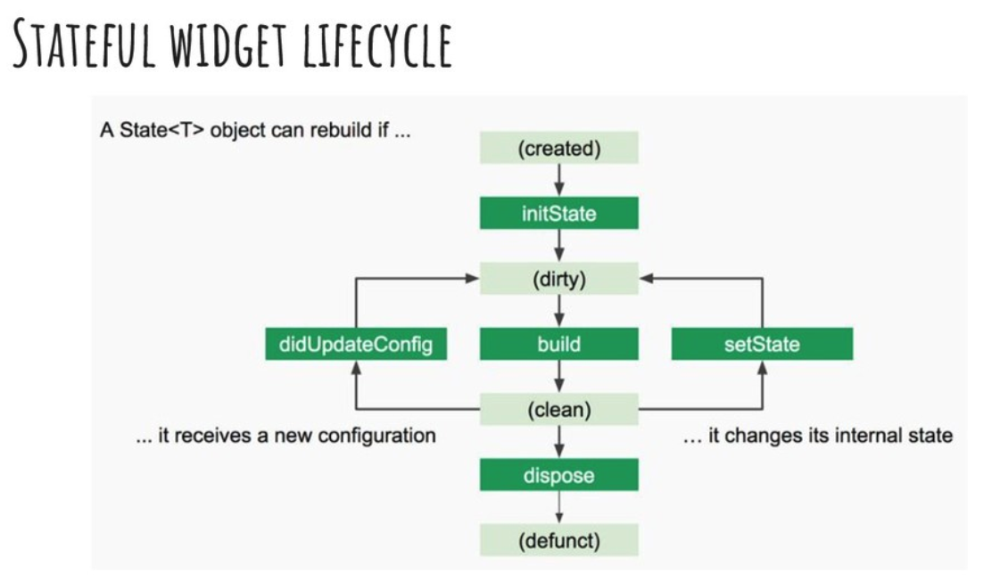

## react native & flutter & pwa
react native:使用js bridget去运行代码， JIT（just in time）, use third party e2e tests

flutter: no bridge, native typed, host reload, AOT(ahead of time),Easy access any native module, 60fps

pwa: 
- not installed(no play store)
- harder if needs native module not created
- 不能使用蓝牙， NFC and fingerprint scan
- 不是所有browsers都支持
- 不是使用ios中的notifications
- ios上不能离线使用
- 不能使用native auth 像 facebook 和谷歌

