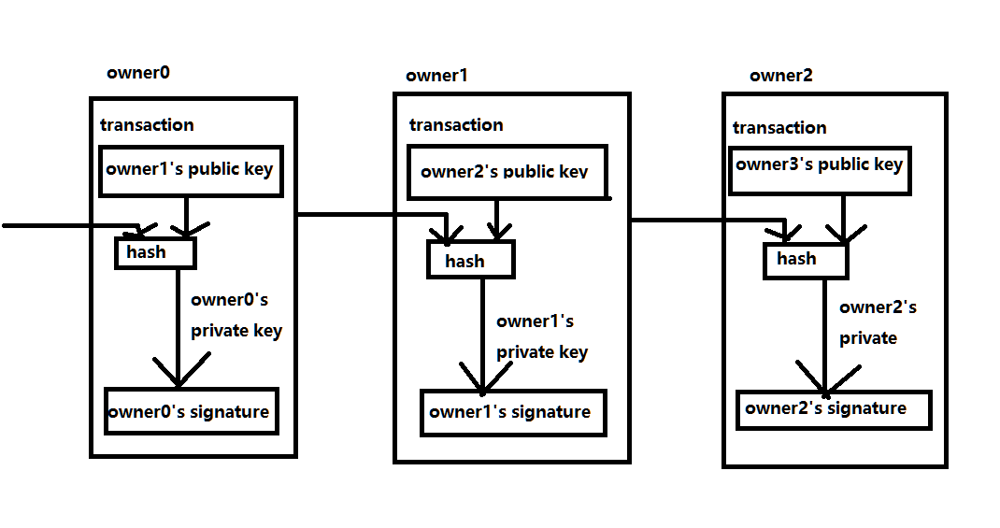
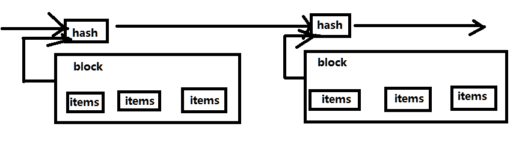

# [bitcoin white page](https://bitcoin.org/bitcoin.pdf) translation

摘要：
  一个纯粹点对点的电子现金会允许从一个到另一个且不需要经过金融组织的直接发起的在线支付。数字点签名提供了一部分的解决方案，
  但是如果一个可信任的第三方组织仍然被需要来防止重复消费，那么主要的好处将会不复存在。我们提出了使用点对点网络的方案来解决
  重复消耗问题。网络的时间戳交易被hash成一条不间断的链，这个链是基于hash的工作量证明的链。最长的链不仅仅是目击事件顺序的证明，而且是cpu能力的池最大的证明。
  只要绝大多数的cpu能力是由哪些不是合作去攻击网络的节点来控制的，他们将生成最长的链并且远超过攻击者。网络自身需要最小结构。消息尽最大努力的广播，节点可以
  自愿离开或者重新加入网络接受最长的工作量证明链作为之前发生什么的证明。

  ## 介绍

  网络上商业已经变得几乎完全依赖于可信任的第三方的金融组织来进行电子支付。尽管系统对大多数交易来说运行足够好，但是它仍然存在基于信任的模型的固有弱点。
  因为金融组织不可能避免调节纠纷，因此完全不可逆的交易是不可能的。 调解的开销增加了交易的开销，限制了最小程度交易的大小和减少了small casual交易的可能性。
  不可逆服务进行不可逆的支付的能力的丧失会有一个广泛的开销。有了可逆的可能性， 信任的需求的就会增长。商人们必须警惕他们的customers,hassling them for more
  information than they would otherwise need. 一定比例的舞弊被认为是不可避免的。这些成本和支付的不确定性可以通过使用事物货币来亲自避免，但没有任何机制可以通过
  一个没有信任方的通信渠道进行支付。

  需要的是基于密码证明而不是信任，允许任何两个有意愿的组织去直接相互交易而不需要通过可信任的第三方组织的电子支付系统。 在计算机上不可逆的交易将会保护卖家防止受欺骗，常规的托管机制很容易实现来保护买家。在这里，我们提出了使用点对点分布时间戳服务器来生成交易时间先后顺序的计算证明的方案来解决双重开销问题。只要比合作攻击者多的诚实的节点来共同控制cpu功率，那么这个系统就是安全的。

  ## 交易

  我们将电子硬币定义为一系列的数字签名。每个所有者通过对上一笔交易和下一个拥有者公钥进行hash然后进行数字签名并且将这些添加到coin的末尾来转移coin到下一个拥有者。收款人可以验证签名来验证所有权的链。

如上图所属：owner1 将 owner0的交易和 owner2 公钥进行hash然后用owner1的私钥进行数字签名，并将其添加到coin的末尾。收款人可以用owner1的公钥进行验证这个签名。

这有一个问题：收款人不能验证所有者中的某个没有做重复开销的coin。通常的解决方案是引进一个可信任的中心机构或者mint,为重复开销来验证每笔交易。在每笔交易之后，这个coin必须返回到mint去发布一个新的coin, 而且只能从可信任不会重复开销的mint中发布coins。这个方案的问题是：整个款项系统的命运依赖于运行mint的公司，因为每一笔交易都必须经过他们，就像银行一样。

我们需要一种方式，为了收款者， 知道上一个拥有者没有签名任何一个早前的交易。为了我们的目的，最早的交易是最重要的，所以我们不在乎之后重复开销。确认缺失的交易的唯一方式就是知道所有的交易。在基于mint模型里，这个mint知道所有的交易和决定谁是最先到达。为了在没有可信任组织的情况下实现这个，交易必须公开宣告，而且我们需要一个系统，为参与者同意他们收到的顺序的单一历史。收款者需要证明在每笔交易的时间里，大多数节点同意他是第一个接收到的。

## 时间戳服务器

我们提供的方案是开始于时间戳服务器。时间戳服务器通过给items的block的hash值加盖时间戳且广泛发布hash值例如在newspaper或Usenet post中进行发布 来运转的。 时间戳提供了必须在时间中存在的数据，以便于进入hash。每个时间戳包含了在形成链的且有额外的时间戳在它之前进行加固的hash的中的上一个时间戳。

## 工作量证明

为了实现在点对点的基础上运行分布式时间戳服务器，我们将需要使用工作量证明系统，类似于Adam Back的Hashcash, 而不是newspaper或Usenet posts.   工作量证明涉及扫描 例如用SHA-256 hash了的以一些0开头的hash值。 所需要的平均工作量是指数级的。

对于我们的时间戳网络来说， 我们通过增加块中的随机数知道找到一个hash值是以要求数量的0开始的hash值 实现工作量证明。 一旦cpu工作被消耗去满足PoW（工作量证明），block 不能不改装这个work的情况下而改变。之后block被chained， 改变block的工作包含重装他之后的所有blocks。

PoW也解决了在主要决策中决定代理人的问题。如果大多数都是基于一个ip地址对一个vote, 它将会被破坏因为任何人都可以分配许多ip。 PoW 是必要的一个cpu对一个vote。 主要的决策代表了最长的链，最长的链有投入的最多的工作量证明量。如果主要的cpu功率是有诚实的节点控制的，诚实的链会增长最快并且超过任何竞争的链。去改变过去的block, 袭击者将必须去重做当前的block和它之后所有的block的PoW,然后赶上和超越诚实节点的工作。

为了弥补在运行的节点中的增长的硬件速度和变化的利益， 工作量证明的难度是通过每个小时在平均数量的block上移动的平均目标来决定的。如果他们生成太快，这个难度也会增加。

## 网络

运行网络的步骤：
- 新的交易在所有节点中广播
- 每个节点收集新的交易到block中
- 每个节点都在为它的block寻找最难的PoW的路上
- 当节点找到一个PoW,它会广播这个block到所有的节点中
- 只有block中所有的交易都是有效且尚未使用时，节点才会接受这个block
- 节点通过在链中创建下一个block B并使用被接受的block A的hash作为block B的previous hash值来表示接受block A

节点总是将最长的链作为正确的那个，并且一直工作在扩展它上面。如果两个节点同时广播不同版本的next block，一些节点可能先接收这一个，也可能先接收另一个，这种情况下，节点们都处理在他们先接收的block上，但是会保存其他的分支以防它变得更长。当下一个PoW被发现且分支变得更长的时候，这个关系将会被打破，然后节点将会切换到更长的那条链上并工作在上面。

新交易广播没有必要到所有的节点，只要他们到达了一些节点，他们将会进入block中在long之前。block广播也能容忍丢掉消息。如果一个节点没有接收到block, 当它接收到下一个block并且意识到丢掉了block的时候它将会请求block 。

## Incentive

依照惯例，block中的第一笔交易是特殊的交易，它开始于一个由block的创建者所拥有的新的coin。这增加了对节点支持网络的激励方案，  且提供一个方式来初始分发coin到发行中，因为这里没有中心组织来发行他们。一定数量的新coin的稳定增长类似于淘金者花费他们的资源去添加黄金到他们的发行量中一样。在我们的例子中，花费的是cpu时间和电力。激励方案也能获得交易费用的资助。如果交易的输出值少于它的输入者，差别在于交易费用被添加到了包含这个交易的block的激励值里面。一旦预定数量的coins进入到发行中，激励可以完全过渡到交易费用中并且完全没有通货膨胀。激励方案可以帮助鼓励节点保持诚实。如果一个贪婪的攻击者能够集合比所有的诚实节点更多的cpu power,他必须在使用它通过窃取自己的付款来欺骗人们 或使用它来生成新硬币之间做出选择。他应该会发现根据规则更喜欢用比其他人包含的更多的新硬币而不是破坏系统和他自己财富的有效性，这样更有利可图。

## 回收磁盘空间

一旦coin中最近的一次交易被埋没在足够blocks之下，在它之前的开销交易将被丢弃从而节省磁盘空间。为了在不打破block的hash的情况下促进这个，交易被hash在merkle树中，merkle树只有一个跟包含block的hash。通过剔除树的分支来压缩旧的block。内部的hash没必要被存储。

一个没有交易的block的头部大概是80个字节。如果我们假设每10分钟生成一个block,那么每年大概是80 bytes * 6 *24*365 = 4.2MB 。Moore's Law预测存储应该不是问题即使block的头部存储在内存中。

## 简单的支付验证

 不运行所有网络节点的情况下去验证支付是可能的。一个用户仅仅需要保留最长PoW链的block的头部的备份，他可以查询网络节点直到他确信他有最长的链，且获取merkle树分支连接交易到被加时间戳的block中。他不能自己验证交易，但是通过链接到chain中的某个位置上， 他可以看见网络中的节点已经接收它。

 因此，只要诚实的节点控制网络，那么这个验证就是可靠的，但是如果是攻击者独揽了网络，那么这个验证是不可信的，弱势的。尽管网络节点可以自己验证交易，但是只要攻击者继续独揽网络，简单的方法将会被攻击者伪造的交易所愚弄。有一个策略可以预防这个，就是接受网络节点的提醒，当网络节点们检测到一个无效的block的时候，提示用户软件去下载所有的block且提醒交易去合适不一致性。收到频繁支付的businesses可能仍然想运行他们自己的节点为了更独立的安全和更快的验证。

 ## 合并和拆分value

尽管独自处理coin是可能，但是在转让中为每个cent做分开交易是笨重的。为了允许value被拆分和合并，交易包含了复杂的输入和输出。一般这有从上一个更大交易的单个输入或负责的合并了更小数量的复杂输入，以及最多两个输出，一个为支付，一个返回更改。

## privacy

