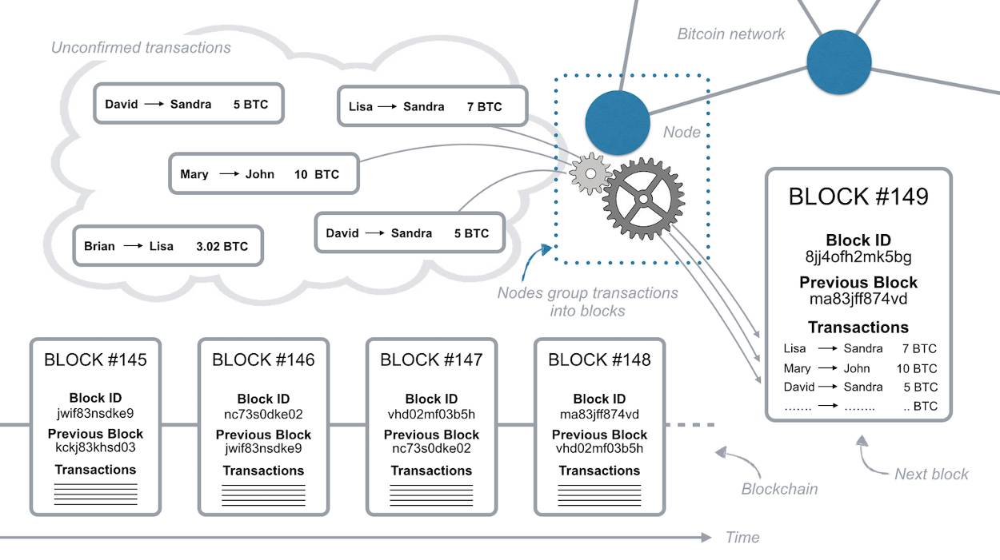

## [how does the blockchain work](https://medium.com/@micheledaliessi/how-does-the-blockchain-work-98c8cd01d2ae)

比特币是数字货币，本身没有价值，他的价值只是因为我们同意交易商品和服务以换取我们控制的更高数量的货币。

为了跟踪比特币的数量，我们每个人都拥有区块链，使用分类账，这是一个跟踪所有比特币交易的数字文件。

该分类账文件没有被存储在中央实体服务器，它通过私人计算机网络分布在世界各地，这些计算机即存储数据又执行计算。这些计算机中的每一个都代表区块链网络的“节点”，并具有分类账文件的副本。

如果大卫想要将比特币发送给sandra,他会向网络广播一条消息，称其账户中的比特币金额应该下降5比特币，而sandra账户的余额应该增加相同数量。网络中的每个节点都将接收消息并将请求的事务应用于其分类帐副本，从而更新账户余额。如图所示：

分类账由一组连接的计算机维护而不是像银行这样的集中式实体维护的事实有几个含义：
- 在我们的银行系统中，我们只知道自己的交易和账户余额，在区块链上，每个人都可以大砍刀每个人的其他交易
- 比特币网络是分发的，如果出现问题，则无需致电服务台或任何人起诉
- 区块链系统的设计使得不需要信任，通过特殊的数学函数和代码获取安全性和可靠性

区块链可以定义为允许一组连接的计算机维护单个更新的安全分类账的系统。

为了能够在区块链上执行交易，您需要一个钱包，一个允许您存储和交换比特币的程序。由于只有您能够使用您的比特币，每个钱包都受到特殊加密方法的保护，该方法使用一对独特但连接的秘钥：私钥和公钥。

使用钱包的私钥加密交易请求时，您正在生成数字签名，区块链计算机使用该签名来仔细检查交易的来源和真实性。数字签名是一串文本，是您的交易请求和私钥组合的结果，因此不能用于其他交易。如果您更改了交易请求消息中的单个字符，则数字签名将发生变化，因此没有潜在的攻击者可以更改您的交易请求或更改您发送的比特币数量。

要发送比特币，您需要证明您拥有特定钱包的私钥，因为您需要使用它来加密交易请求消息。请注意，由于您仅在加密后广播邮件，因此您永远不必透漏您的私钥。

区块链中的每个节点都保留了分类账的副本。区块链系统根本不跟踪账户余额，它只记录所请求的每一笔交易。实际上,分类账不跟踪余额，它只跟踪比特币网络内广播的每笔交易，如下图所示：

要了解您的钱包余额，您需要分析并验证连接到钱包的整个网络上发生的所有交易。由于与先前交易的链接，执行此余额验证。为了向John发送10个比特币，Mary必须生成一个交易请求，其中包含指向总余额等于或超过10比特币的先前收到交易的链接。这些链接称为输入，网络中的节点将验证这些事物的总量是否等于或超过10比特币，并且这些输入尚未用完。实际上，每次在交易中引用输入时，这些输入在未来的任何交易中都被视为无效。这一切都在mary的钱包中自动执行，并由比特币网络节点进行双重检查，她只使用他的公钥向John的钱包发送10BTC交易。

那么，系统如何信任输入事物并认为他们有效？它会检查与您用于通过每个输入作为输入的引用发送比特币的钱包相关的所有先前交易。为了简化和加速验证过程，网络节点保留了未花费的事务的特殊记录。由于这种安全检查，不可能花费两倍的比特币。

在比特币网络上执行交易的所有代码都是开源的，这意味着任何拥有笔记本电脑和互联网连接的人都可以运营交易。但是，如果用于广播事务请求消息的代码中存在错误，则相关的比特币将永久丢失。请记住，由于网络是分布式的，因此，没有客户支持呼叫，也没有任何人可以帮助您恢复丢失的交易或忘记的钱包密码。因此，如果您有兴趣在比特币网络上进行交易，建议使用开源和官方版本的比特币钱包软件（如比特币核心），并将钱包的密码或私钥存储在一个非常安全的存储库中。

任何人都可以通过匿名连接（即TOR网络或VPN网络）访问比特币网络，并提交或接收仅显示其公钥的交易。但是，如果有人反复使用相同的公钥，则可以将所有交易连接到同一所有者。比特币网络允许您生成任意数量的钱包，每个钱包都有自己的私钥和公钥。这允许您接收不能链接在一起的不同钱包的付款，除非您将所所有收到的比特币发送到一个钱包，否则无法知道您拥有所有这些钱包私钥。可能的比特币地址总数是2的160次方幂，这个大数字可以保护网络免受可能的攻击，同时允许任何人拥有钱包。

通过这种设置，仍然存在一个主要的安全漏洞，可以利用它来回收比特币。事务在网络中从节点传递到节点，因此两个事务到达每个节点的顺序可以不同。攻击者可以发送交易，等待对方运送产品，然后将反向交易发送回自己的账户。在这种情况下，一些节点可以在第一个事务之前接收第二个事务，因此当事务输入结果已经花费的时候，他们认为他们的第一个支付事务无效。按时间戳订购交易是不安全的因为它很容易被伪造。因此，没有办法判断交易是否发生在另一个交易之前，这就开辟了欺诈的可能性。

如果发生这种情况，网络节点之间就每个接收的交易顺序存在分歧。因此区块链系统被设计为使用节点协议来订购交易并防止上述欺诈。比特币网络通过将他们组合成称为b锁的组来命令事务，每个块包含一定数量的事务和前一个块的链接。这就是将一个快一个接一个地放在一起的原因。因此，块被组织成一个与时间相关的链，整个系统的名称就是区块链，如图所示:

简化了链链序列结构

同一块中的事务被认为是同时发生的，并且尚未在块中的事务被认为是未经证实的。每个节点可以将事务组合成一个块并将其广播到网络，作为下一个块应该是什么块。由于任何节点都可以建议一个新块，为了天骄到区块链中，每个块必须包含使用不可逆哈希函数创建的复杂数学问题的答案。解决此类数学问题的唯一方法是猜测与先前块内容组合的随机数生成定义的结果（通常是低于特定值的数字）。一台典型的计算机可能需要大约一年的时间来猜测正确的数字并解决数学问题。然而，由于网络中的大量计算机正在猜测数字，所有平均每10分钟解决一个块。解决此类数学问题的节点将获取将下一个块放置在链上并将其广播到整个网络的权利。

如果两个节点同时解决问题并同时将其块传播到网络中，这种情况下，两个块都被广播，并且每个节点都建立在它首先接收的快上，但是区块链系统要求每个节点立即构建在可用的最长块链上。因此，每个节点将采用最长链作为唯一选项。

由于同时解决块的概率很低，几乎不可能同时解决多个块一次又一次地构建不同的尾部，因此整个区块链可以快速稳定到每个节点同意的一串的块。关于哪个区块代表链尾部结束的分歧，再次打开了欺诈的可能性。如果事务恰好是在一个块属于一个较短的尾部（像图7中的块B），下个块就解决了这样的交易，返回到未确认交易作为包括在所有其他块B。

例如： Mary将钱会给John,然后John将产品发送给Mary,因为节点总是采用较长的尾部作为确认事务，如果Mary可以生成包含具有相同输入引用的反向事务的较长尾部，John将不在他的钱和他的产品。

那么系统如何防止这种欺诈？每个块包含对前一个块的引用，并且该引用是需要解决的数学问题的一部分，以便将以下块扩展到网络。因此，由于解决块所需的大量随机猜测，预先计算一系列块非常困难并将其放在区块链上。玛丽正在与网络的其他部分进行比赛，以解决数学问题，使他能够将下一个区块放在链上。即使她在其他人之前解决了这个问题，她也不太可能连续解决2个，3个或更多的障碍，因为每次她都在与整个网络竞争。那么，Mary可以使用超高速计算机生成足够的随机猜测来与整个网络竞争解决块吗？是的，但即使计算机速度非常快，由于网络中的成员数量很多，玛丽也不太可能在执行双重攻击所需的确切时间内连续解决几个blocks。她需要控制整个网络50%的计算能力才能有50%的机会在某个其他节点之前解决一个块，即使在这种情况下，他有25%的几率连续解决两个块。连续解决的块越多，玛丽成功的概率就越低。

比特币区块链系统中的交易受到数学竞赛的保护，任何攻击者都在与整个网络竞争。

因此，随着时间的推移，交易变得越来越安全。在过去已经确认的块中那些交易币在最后一个块中的交易更安全。
由于块平均每10分钟被添加到链中，等待一个小时后第一次包含在块中的交易很大概率已经被处理了且有不可逆性。

区块链交易安全性

为了能够发送比特币，您需要引用将比特币发送到您的钱包的交易，这适用于网络中发生的所有交易。作为平衡比特币由于软件错误和钱包密码丢失而产生的通缩性质的一种方法，对那些解决每个块的数学问题的人给予了奖励。运行比特币区块链软件以获得这些比特币奖励的活动被称为“采矿”，类似于采矿黄金。此奖励是推动私人操作节点的主要动机，从而提供处理比特币交易和稳定区块链网络所需的必要计算能力。

由于典型计算机需要很长时间才能解决块（平均约1年），所以节点聚集在一起，分组的每个人必须尝试猜测次数才能解决下一个块。通过这种方式，小组能够更快地猜出正确的数字并获取小组成员之间共享的奖励。这些群体被称为矿池。

其中一些采矿池相当大，占整个网络计算能力的20%以上。这对于网络安全有明显的影响，即使其中一个池可能获取50%的网络计算能力，一个块获取的链越往后，其中包含的事务就越安全。但是，其中一些获取大量计算能力的矿池决定限制其成员数量，以保障整体网络安全。由于技术创新和节点数量的增加，整体网络计算能力可能会随着时间的推移而增加，因此区块链系统平均10分钟重新校准整个网络中解决下一个块的定位的数学问题难度。这确保了网络的稳定性和整体安全性。

此外，每4年块奖励减少一半，因此随着时间的推移，挖掘比特币变得不那么有趣。为了防止节点停止运行网络，可以将小的奖励费用附加到每个交易，这些奖励被包含交易的块的节点成功地收集并解决其数学问题。由于这种机制，与较高奖励相关联的交易通常比与较低奖励相关联的交易处理得更快。这意味着在发送交易时，您可以决定是否要更快地处理它（等于更昂贵） 或更便宜（等于更耗时）。如果与银行收费相比并且与交易金额无关，比特币网络中的交易费用目前非常小。

使用区块链技术的好处：
- 您可以完全控制自己拥有的价值，没有第三方持有您的价值或者限制您对其的访问权限
- 在地球上任何地方执行脚趾交易的成本非常低，这允许小额支付
- 价值可以在几分钟内转移，交易可以在几个小时内被认为是安全的，而不是几天或几周
- 由于任何人都可以随时验证区块链上的每笔交易，因此可以完全透明获得
- 可以利用区块链技术构建分散的应用程序是可能的，这些能够快速，安全的管理信息和价值转移

使用区块链存在的问题：
- 可以匿名发送和接收交易。一方面，这保留了用户的隐私，另一方面允许网络上的非法律活动，因为机构无法跟踪用户身份
- 即使很多交易所平台正在出现，用比特币交易商品和服务仍然不是那么容易。然而，它们正变得越来越流行
- 与许多其他加密币一样，比特币非常不稳定，市场上没有那么多的比特币，而且需求正在快速变化。比特币价格受到加密货币行业的大型活动或公告的影响
- 该技术仍处于起步节点。每天都在开发新工具，以提高区块链的安全稳定性，同时提供更广泛的功能，工具和服务。

